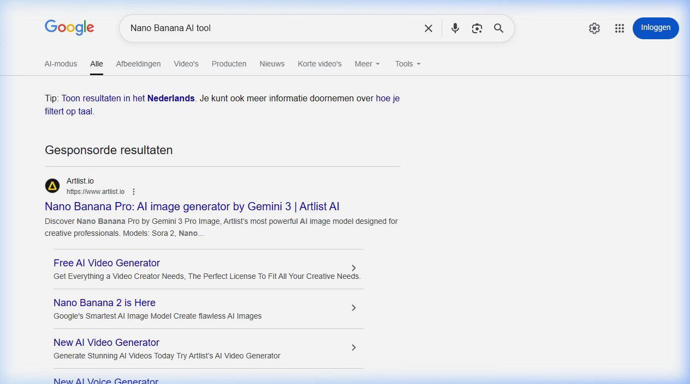

{.img-fluid .rounded}

[Nano Banana 2](https://gemini.google/overview/image-generation/) is Google's AI-beeldgenerator, beschikbaar via [Gemini](gemini.qmd). De naam klinkt misschien speels, maar de mogelijkheden zijn serieus: Nano Banana 2 laat je **afbeeldingen genereren, bewerken en stylen** direct in Gemini, via een tekstprompt.

## Wat kan Nano Banana 2?

- **Genereren**: maak een nieuwe afbeelding vanuit een tekstomschrijving
- **Sfeer aanpassen**: transformeer een zonnige dag in een mysterieuze nacht, verander de belichting of het camerastandpunt
- **Stijl overnemen**: neem de textuur, kleur of stijl van een andere foto over en pas die toe op jouw afbeelding
- **Formaten aanpassen**: pas het formaat aan voor verschillende platforms (vierkant, liggend, staand) zonder details te verliezen
- **Tekst in afbeeldingen**: maak logo's, posters, uitnodigingen of strips met kristalheldere tekst in meerdere talen

## Hoe gebruik je het?

Nano Banana 2 is geïntegreerd in Gemini. Ga naar [gemini.google.com](https://gemini.google.com/), start een gesprek en vraag om een afbeelding te genereren of te bewerken.

## Gratis vs. betaald

Nano Banana 2 is beschikbaar in de gratis versie van Gemini, maar met beperkte aantallen generaties per dag. Google AI Pro geeft toegang tot meer en hogere kwaliteit gegenereerde afbeeldingen.

## Vergelijking met andere beeldgeneratoren

| Tool | Sterk in | Toegang |
|---|---|---|
| Nano Banana 2 | Fotorealisme, tekst in afbeelding | Via Gemini (gratis) |
| [Midjourney](midjourney.qmd) | Artistieke kwaliteit | Betaald abonnement |
| Canva AI | Afbeeldingen in ontwerpen | Via Canva (gratis) |

## Ethische noot

Alle door Nano Banana 2 gegenereerde afbeeldingen bevatten een onzichtbaar digitaal watermerk (SynthID van Google DeepMind), zodat de AI-oorsprong later te traceren is.
