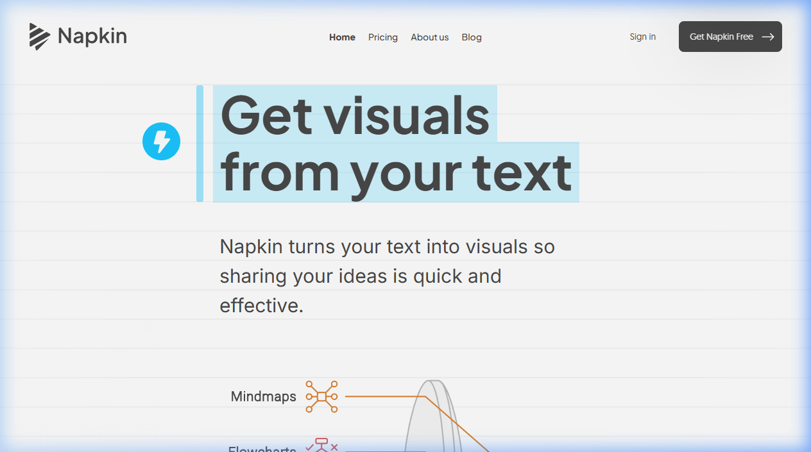
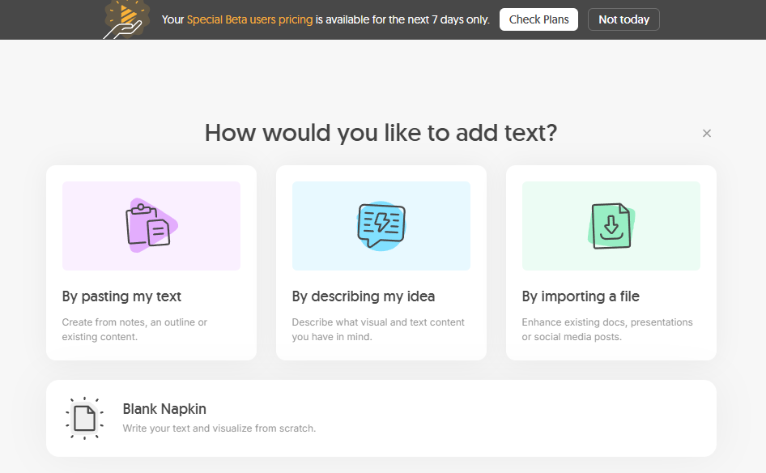
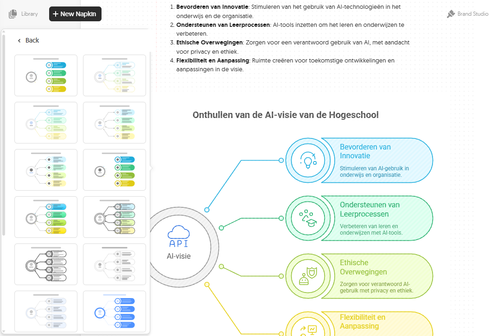
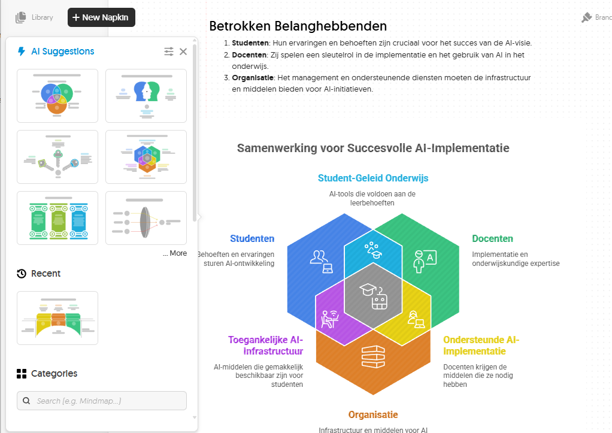

{.img-fluid .rounded}

[Napkin AI](https://www.napkin.ai/) is een tool met één heel specifieke superkracht: het omzet tekst automatisch in **visuele schema's, infographics en diagrammen**. Je plakt een tekstpassage, Napkin analyseert de structuur en genereert meerdere visuele weergaven om uit te kiezen.

## Hoe werkt het?

1. Plak je tekst (een uitleg, een stappenplan, een vergelijking)
2. Napkin genereert automatisch meerdere visuele opties: flowcharts, lijsten met iconen, vergelijkingstabellen, tijdlijnen
3. Klik op de variant die het beste past
4. Pas kleuren, iconen en tekst aan
5. Exporteer als PNG, SVG of PDF

Napkin heeft een gratis versie waarmee je al de kernfuncties kunt gebruiken. De betaalde versie geeft meer exports, hogere resolutie en merkuitstraling.

