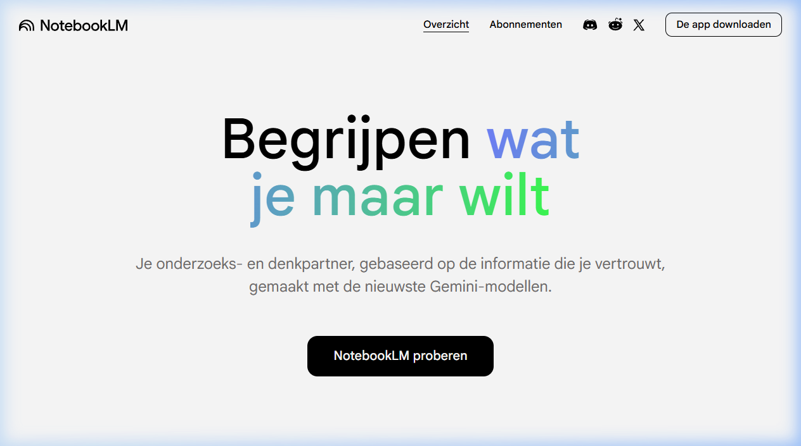

{.img-fluid .rounded}

[Google NotebookLM](https://notebooklm.google.com/) is zo'n pareltje van Google dat ze zelf waarschijnlijk ook niet voorzien hadden. Het concept is simpel: je upload een aantal bronnen (pdf's bijvoorbeeld) vult dat aan met online bronnen (video's, websites etc) die het taalmodel voor je kan zoeken op basis van een prompt. Dat geheel van bronnen vormt dan de kennisbasis waar je vragen over kunt stellen, een podcast kunt laten genereren, een video-overzicht, infographics, mindemap, flashcards, rapporten, quizzes, gegevenstabellen, diapresentaties. De lijst is bijna te lang om op te noemen en wekelijks lijken er per onderdeel wel functionaliteiten bij te komen.
