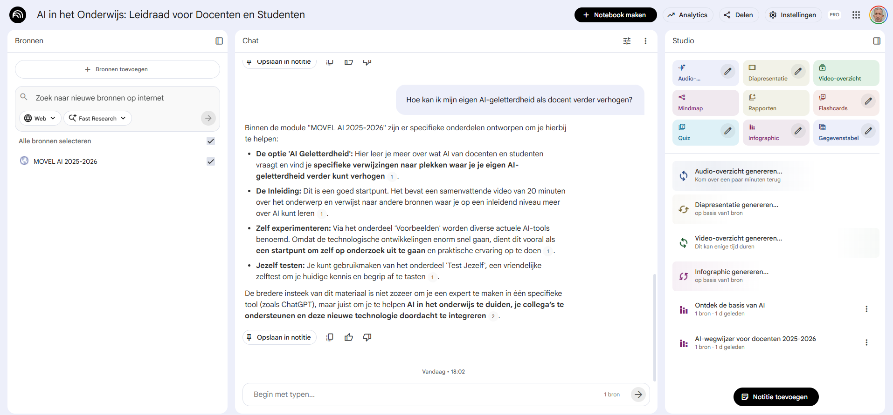
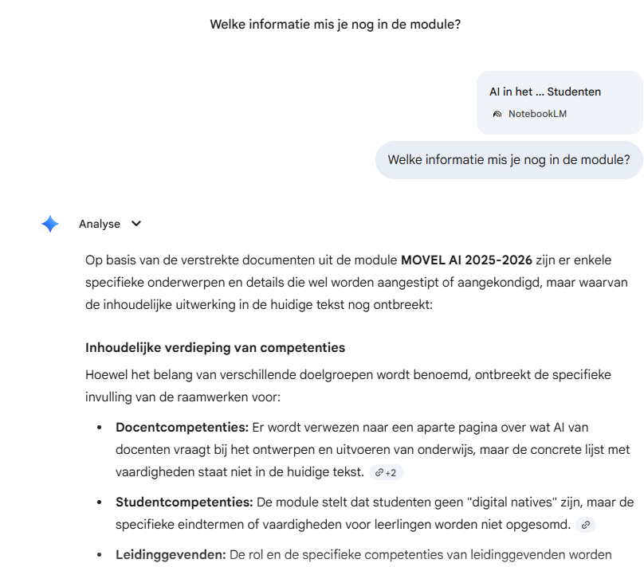

{.img-fluid .rounded}

[Google NotebookLM](https://notebooklm.google.com/) is zo'n pareltje van Google dat ze zelf waarschijnlijk ook niet voorzien hadden. Het concept is simpel: je upload een aantal bronnen (pdf's bijvoorbeeld) vult dat aan met online bronnen (video's, websites etc) die het taalmodel voor je kan zoeken op basis van een prompt. Dat geheel van bronnen vormt dan de kennisbasis waar je vragen over kunt stellen, een podcast kunt laten genereren, een video-overzicht, infographics, mindemap, flashcards, rapporten, quizzes, gegevenstabellen, diapresentaties. De lijst is bijna te lang om op te noemen en wekelijks lijken er per onderdeel wel functionaliteiten bij te komen.

Het mooie is dat je een hele verzameling bronnen bij elkaar kunt bewaren en daar dan vragen over kunt stellen. Je kunt het notebook tegenwoordig ook als bron gebruiken in [Gemini](gemini.qmd).

In dit specifieke geval ben ik het overigens niet helemaal met de analyse eens, maar dat is een ander verhaal. Het gaat om het idee. 
