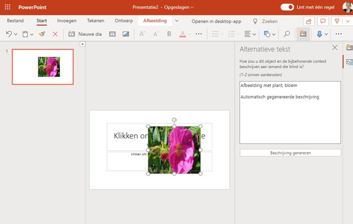

Soms zie je de AI niet eens, maar ook in Microsoft 365 (Office 365) zit heel wat AI verwerkt. Denk aan het laten voorlezen van een Word-document (tekst naar spraak), maar ook als je een afbeelding toevoegt in PowerPoint. Dan voegt de AI automatisch een tekstbeschrijving toe aan de afbeelding. 

### Microsoft 365 Copilot
De hoeveelheid AI in Microsoft 365 nam nog veel verder toe met de introductie van Copilot. Dit is een krachtige assistent die direct in Word, Excel en Outlook werkt. Veel van de functionaliteit zit achter een betaald account. En binnen schoolomgevingen zal de systeembeheerder bepalen of en hoe je hiermee aan de slag kunt.

## DPIA
Dat zal afhankelijk zijn van de kosten, maar ook van bijvoorbeeld [de analyses van SURF](https://www.surf.nl/en/news/privacy-risks-microsoft-365-copilot-to-orange) als het gaat over hoe Microsoft omgaat met de data die je invoert. Door middel van een zogeheten DPIA (Data Protection Impact Assessment) wordt gekeken naar de risico's van het gebruik van Copilot in het onderwijs. De situatie in september 2025 was dat de kleur van rood naar oranje was verandert, maar nog niet op groen stond. Niet alle risico's waren naar tevredenheid van SURF aangepakt.

Ook als je geen toegang hebt tot de volledige Copilot Pro, kun je in de **Edge browser** gebruik maken van Copilot om vragen te stellen over een PDF die je daar opent. Zoals je in de afbeelding hierboven ziet, kan Copilot een samenvatting geven van een Engelstalig document in het Nederlands.
