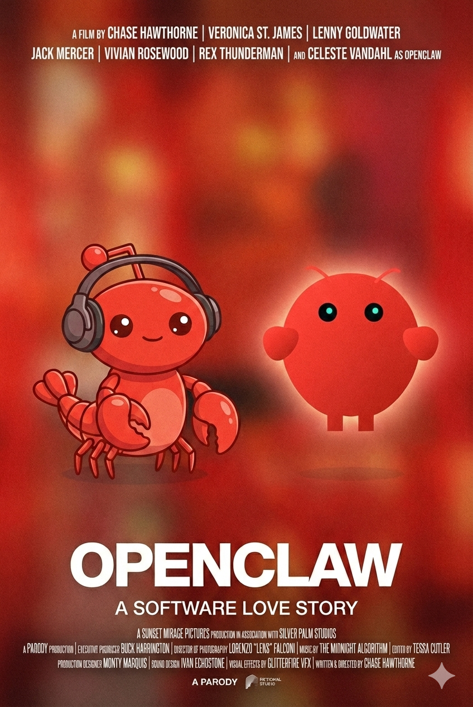

## Wat is OpenClaw?
[OpenClaw](https://openclaw.ai/) is een gratis, opensource, zelfgehoste autonome AI-agent (voorheen Clawdbot/Moltbot) ontwikkeld door [Peter Steinberger](https://steipete.me/), die taken uitvoert via grote taalmodellen (LLM's). Het fungeert als een persoonlijke assistent die via chat-apps zoals WhatsApp en Telegram e-mails beheert, agenda's bijhoudt en acties op je computer uitvoert.
Het project zag het daglicht in de loop van 2025 onder de naam Clawdbot. Maar omdat Anthropic een product had met een vergelijkbare naam, werd de naam al snel veranderd in eerst Moltbot en daarna in OpenClaw.
Begin 2026 ging het project viraal en begonnen mensen massaal hun eigen agent te hosten. Tegelijkertijd kwamen er ook wel de nodige berichten over beveiligingsrisico's. Ook kwamen er de nodige varianten op het project die vergelijkbare functionaliteiten boden, maar compacter of veiliger waren. 

Uitgebreide uitleg over OpenClaw:


en ook Moltbook:


Moraal van dit verhaal (van deze video's): niet té serieus nemen allemaal.
Ik schreef begin 2026 een [blog over OpenClaw en Moltbook](https://ictoblog.nl/2026/02/01/openclaw-moltbook-her). 

## Goed idee?
Korte antwoord: nee.

Lange antwoord: als je toe bent aan het experimenteren met OpenClaw, dan is deze module waarschijnlijk veel te simpel voor je of was je niet echt de doelgroep. Maar, het is wel een voorbeeld van waar het naartoe kan gaan met AI-assistenten. Zie ook [de inleiding](/inleiding/ai-onderwijs.qmd) over AI in het onderwijs. 