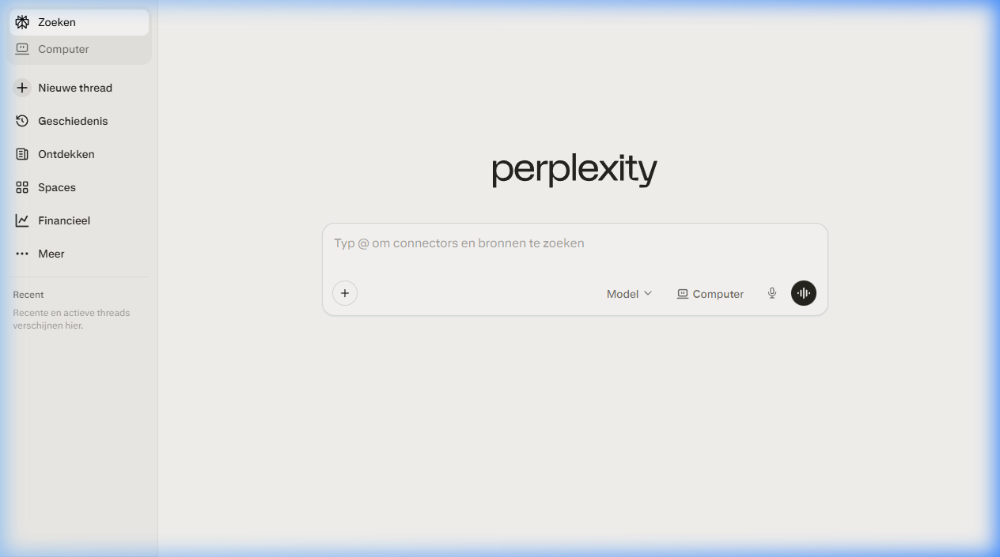
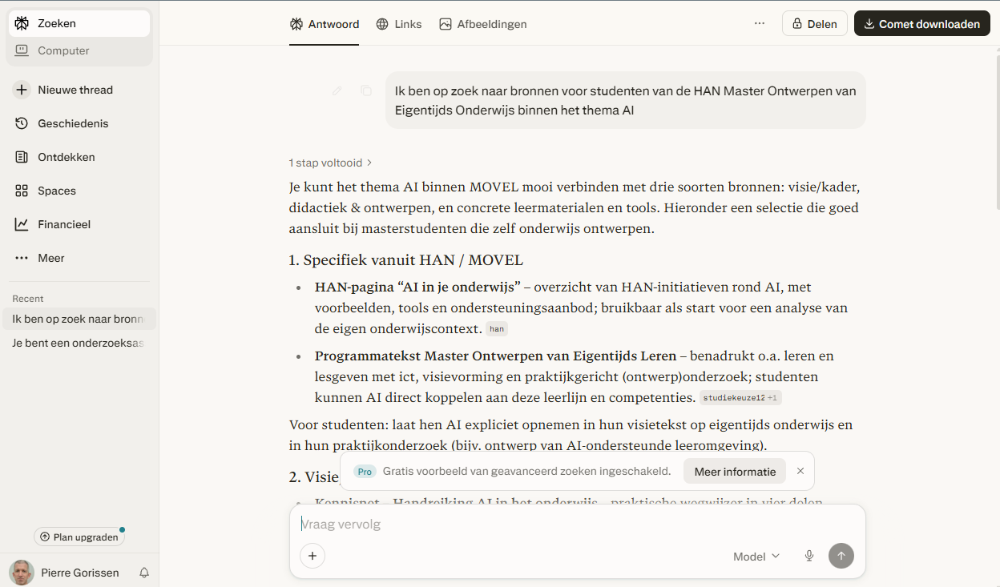

{.img-fluid .rounded}

[Perplexity AI](https://www.perplexity.ai/) is een AI-zoekmachine: je stelt een vraag en krijgt een antwoord dat direct bronnen vermeldt. Het combineert de vlotte interface van een chatbot met de bronvermelding van een zoekmachine. 

{.img-fluid .rounded}

De gratis versie stelt je in staat om een gevoel te krijgen voor de functionaliteit, voor de meer geavanceerde zaken heb je een betaald abononement nodig. En dat maakt het toch wat ingewikkelder als je toch al [ChatGPT](chatgpt.qmd), [Gemini](gemini.qmd) of [NotebookLM](notebooklm.qmd) gebruikt die ook een deepresearch-functionaliteit hebben.

