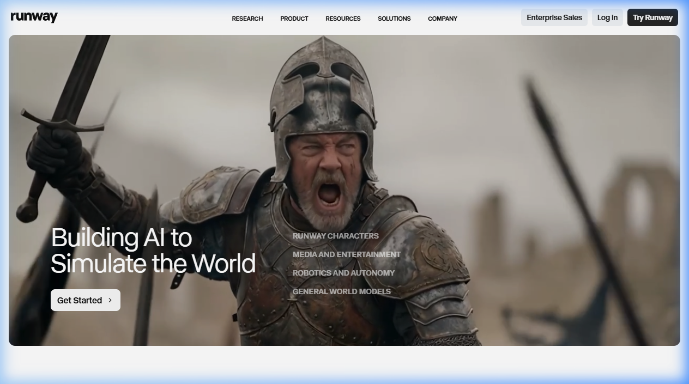

{.img-fluid .rounded}

[Runway](https://runwayml.com/) is een van de meest gebruikte AI-platforms voor **creatieve videoproductie**. Waar veel AI-videogeneratoren puur tekst naar video omzetten, onderscheidt Runway zich door een breed scala aan bewerkingstools waarmee je bestaand beeld kunt transformeren, uitbreiden en verfijnen.

## Wat kan Runway?

- **Gen-3 Alpha Turbo** — tekst naar video: beschrijf een scène, krijg een video van 5–10 seconden
- **Image to Video** — animeer een stilstaande afbeelding
- **Video to Video** — pas de stijl van een bestaand videoclip aan (bijv. omzetten naar tekenfilm-stijl)
- **Inpainting** — verwijder objecten uit video of vervang achtergronden
- **Frame Interpolation** — maak schokkerige video vloeiender
- **Remove Background** — haal de achtergrond uit video, zoals een groen scherm maar zonder groen scherm
- **Lip Sync** — synchroniseer lippen van een personage met een audio-opname

## Gratis vs. betaald

| Laag | Credits/mnd | Prijs |
|---|---|---|
| Gratis | 125 credits | €0 |
| Standard | 625 credits | $15/mnd |
| Pro | 2.250 credits | $35/mnd |

Eén seconde video kost gemiddeld 5 credits. De gratis laag is dus beperkt, maar voldoende om de tool uit te proberen.

## Educatieve toepassingen

- Studenten laten ervaren hoe makkelijk beeldmateriaal te manipuleren is (mediawijsheid)
- Kleine filmpjes maken voor schoolprojecten zonder camera of montage-software
- Achtergronden verwijderen voor presentatievideo's

## Vergelijking

| Tool | Sterk in |
|---|---|
| Runway | Creatieve bewerkingen, breed toolset |
| [Veo 3.1](veo.qmd) | Realistische video met geluid |
| [Kling AI](kling-ai.qmd) | Lange video's, lipsynced |
| [HeyGen](heygen.qmd) | Presentatie-avatars, vertaling |
