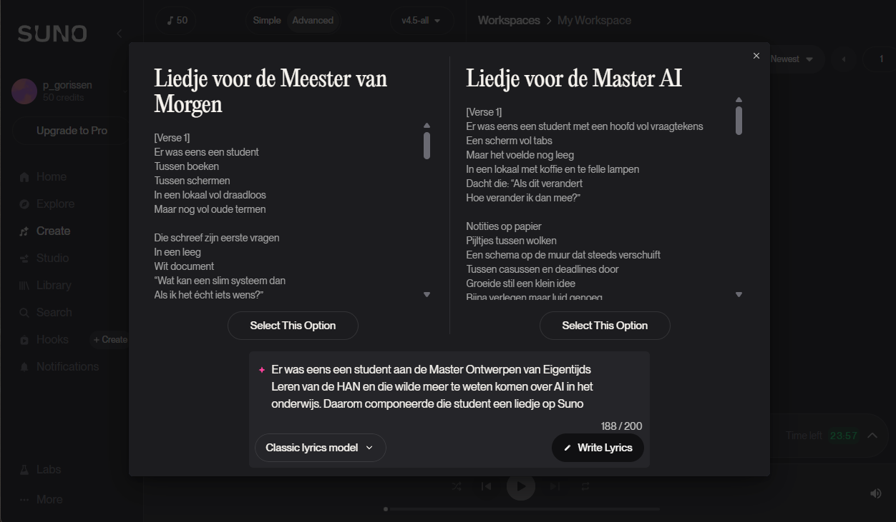
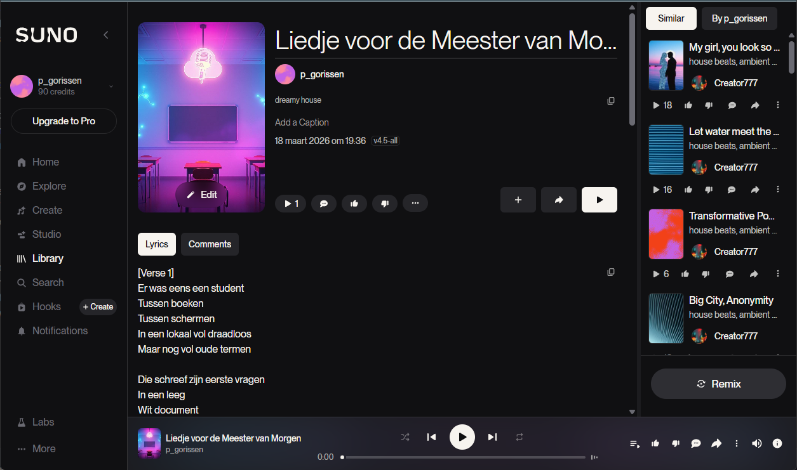

{.img-fluid .rounded}

[Suno](https://suno.com/) is een AI-muziekgenerator: beschrijf in een paar woorden welk nummer je wilt — genre, sfeer, instrumentatie, thema — en Suno genereert binnen seconden een volledig nummer met zang, instrumentale begeleiding en teksten.

Je kunt ook zelf de tekst schrijven en Suno vragen die op muziek te zetten, dan heb je meer controle over de inhoud. Met de gratis optie krijg je 50 credits per dag, genoeg voor ongeveer 10 nummers.

En het resultaat? Je kunt het hieronder beluisteren. 

Tja...

::: {.callout-warning}
## Ethische kwesties
Suno is getraind op grote hoeveelheden muziek van het internet, inclusief nummers van artiesten die hier nooit toestemming voor hebben gegeven. Er lopen rechtszaken van platenlabels. Dit maakt Suno tot een goed gespreksonderwerp over auteursrecht, creativiteit en de rechten van artiesten in het AI-tijdperk. Maar minder geschikt om serieus zelf muziek mee te maken.

Bijkomend probleem is dat diensten als Spotify op dit moment overspoeld worden met AI-muziek, waardoor echte artiesten nóg meer moeite hebben om op te vallen tussen het enorme aanbod (en wat te verdienen met hun muziek). Zie ook [dit artikel](https://nos.nl/artikel/2584050-spotify-pakt-ai-aan-om-artiesten-te-beschermen-75-miljoen-liedjes-verwijderd).

:::

<audio controls>
  <source src="media/Liedje voor de Meester van Morgen.mp3" type="audio/mpeg">
  Your browser does not support the audio element.
</audio>