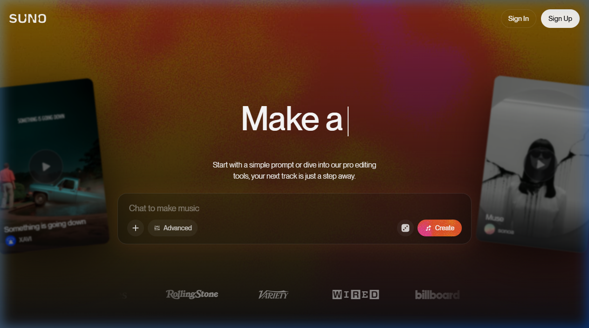

{.img-fluid .rounded}

[Suno](https://suno.com/) is een AI-muziekgenerator: beschrijf in een paar woorden welk nummer je wilt — genre, sfeer, instrumentatie, thema — en Suno genereert binnen seconden een **volledig nummer** met zang, instrumentale begeleiding en teksten.

## Hoe werkt het?

1. Ga naar [suno.com](https://suno.com/) en maak een gratis account
2. Typ een korte beschrijving: *"upbeat Dutch children's song about frogs, ukulele, playful"*
3. Klik op *Create* en ontvang twee versies van het nummer
4. Luister, download en deel

Je kunt ook zelf de tekst schrijven en Suno vragen die op muziek te zetten — dan heb je meer controle over de inhoud.

## Gratis vs. betaald

| Laag | Generaties | Prijs |
|---|---|---|
| Gratis | ~50 credits/dag (~10 nummers) | €0 |
| Pro | 2.500 credits/mnd | $10/mnd |
| Premier | 10.000 credits/mnd | $30/mnd |

De gratis laag is voor educatief gebruik ruim voldoende.

## Educatieve toepassingen

- Studenten een nummer laten schrijven over een lesstof-begrip (verwerking via creativiteit)
- Een jingle of deuntje bij een les of schoolevenement genereren
- Vergelijken: "klinkt dit als bestaande muziek?" — auteursrechten en originaliteit bespreken
- Muziekles: AI als compositie-assistent

## Ethische kwesties

Suno is getraind op grote hoeveelheden muziek van het internet, inclusief nummers van artiesten die hier nooit toestemming voor hebben gegeven. Er lopen rechtszaken van platenlabels. Dit maakt Suno tot een goed gespreksonderwerp over **auteursrecht, creativiteit en de rechten van artiesten** in het AI-tijdperk.

## Verwant

- [ElevenLabs](elevenlabs.qmd) — tekst-naar-spraak en stemkloning
- [Gemini Muziekgeneratie](https://gemini.google/overview/music-generation/) — Google's muziekmodule
