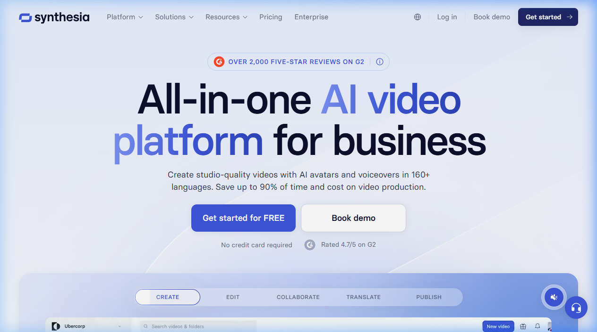

{.img-fluid .rounded}

[Synthesia](https://www.synthesia.io/) is een platform voor het maken van **professionele video's met AI-avatars** — zonder camera, microfoon of videoprogramma. Je typt een script, kiest een avatar, en Synthesia genereert een video van een realistisch uitziende presentator die jouw tekst voordraagt.

Synthesia richt zich primair op **bedrijfs- en onderwijsvideo's**: trainingsvideo's, instructiemateriaal, onboarding, communicatie-updates.

## Hoe werkt het?

1. Kies een van de 230+ ingebouwde avatars (of maak een eigen avatar van jezelf)
2. Typ of plak een script
3. Kies een taal en stem (130+ talen beschikbaar)
4. Pas de lay-out, achtergrond en eventuele slides aan
5. Genereer de video — klaar in minuten

## Wat maakt Synthesia anders dan HeyGen?

Zowel Synthesia als [HeyGen](heygen.qmd) genereren avatar-video's, maar er zijn accentverschillen:

| Aspect | Synthesia | HeyGen |
|---|---|---|
| Doelgroep | Bedrijf & onderwijs | Breed, ook marketing |
| Template-bibliotheek | Uitgebreid | Beperkt |
| Eigen avatar | Optioneel | Centraal feature |
| Videovocaties | Trainings- en instructievideo's | Vertaling, marketing |

## Gratis vs. betaald

Synthesia biedt een **gratis plan** met:
- 3 minuten video per maand
- Beperkte avatarselectie
- Zonder watermerk

Betaalde plannen starten vanaf $29/mnd voor meer video en avatars.

## Educatieve toepassingen

- Instructievideo's maken zonder voor een camera te verschijnen
- Lesinhoud toegankelijk maken in meerdere talen
- Studenten laten nadenken over de (on)herkenbaarheid van nep-presentatoren
- In combinatie met [Whisper](whisper.qmd): transcribeer een bestaande les en genereer er een Synthesia-video van
