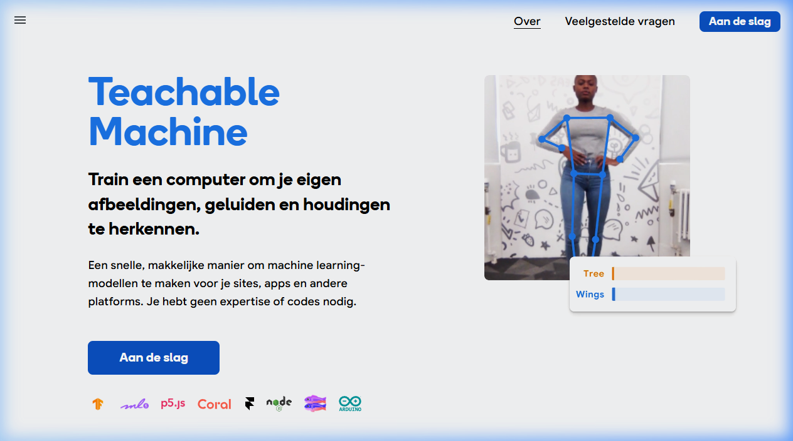

{.img-fluid .rounded}

[Teachable Machine](https://teachablemachine.withgoogle.com/) van Google is een laagdrempelige, gratis experimenteeromgeving waarmee je in een paar minuten je eigen machine-learningmodel kunt trainen — geheel in de browser, zonder een regel code te schrijven.

{fig-alt="Animatie die Teachable Machine in actie toont"}

## Wat kun je ermee?

Je kunt drie typen modellen trainen:

| Type | Wat je ermee doet |
|---|---|
| **Afbeelding** | Laat de webcam beelden herkennen en indelen in door jou gekozen categorieën |
| **Audio** | Laat de microfoon geluiden of woorden herkennen |
| **Pose** | Herken lichaamshoudingen via de webcam |

## Hoe werkt het? — in 3 stappen

1. **Verzamel voorbeelden**: neem via je webcam (of upload afbeeldingen) voorbeelden op voor elke klasse. Bijv. klasse 1 = "duim omhoog", klasse 2 = "duim omlaag"
2. **Train het model**: klik op "Train" — Teachable Machine traint het model direct in je browser
3. **Test en exporteer**: test het model live via je webcam of microfoon; exporteer het vervolgens voor gebruik in apps via TensorFlow.js

## Educatieve waarde

Teachable Machine is bij uitstek geschikt om studenten en leerlingen te laten **ervaren** hoe machine learning werkt:

- Hoe training met voorbeeldata werkt
- Wat het effect is van meer of minder trainingsdata
- Wat "overfitting" is (het model herkent alleen de exacte trainingsopnames)
- Hoe bias in trainingsdata leidt tot fouten in het model

Het is een ideaal hulpmiddel voor docenten die de concepten achter AI op een hands-on manier willen uitleggen, ook zonder technische achtergrond.

## Verder

Gemaakte modellen kunnen worden geëxporteerd en ingebed in websites of apps via TensorFlow.js. Er zijn uitstekende [tutorials beschikbaar](https://teachablemachine.withgoogle.com/faq) op de Google-website.
