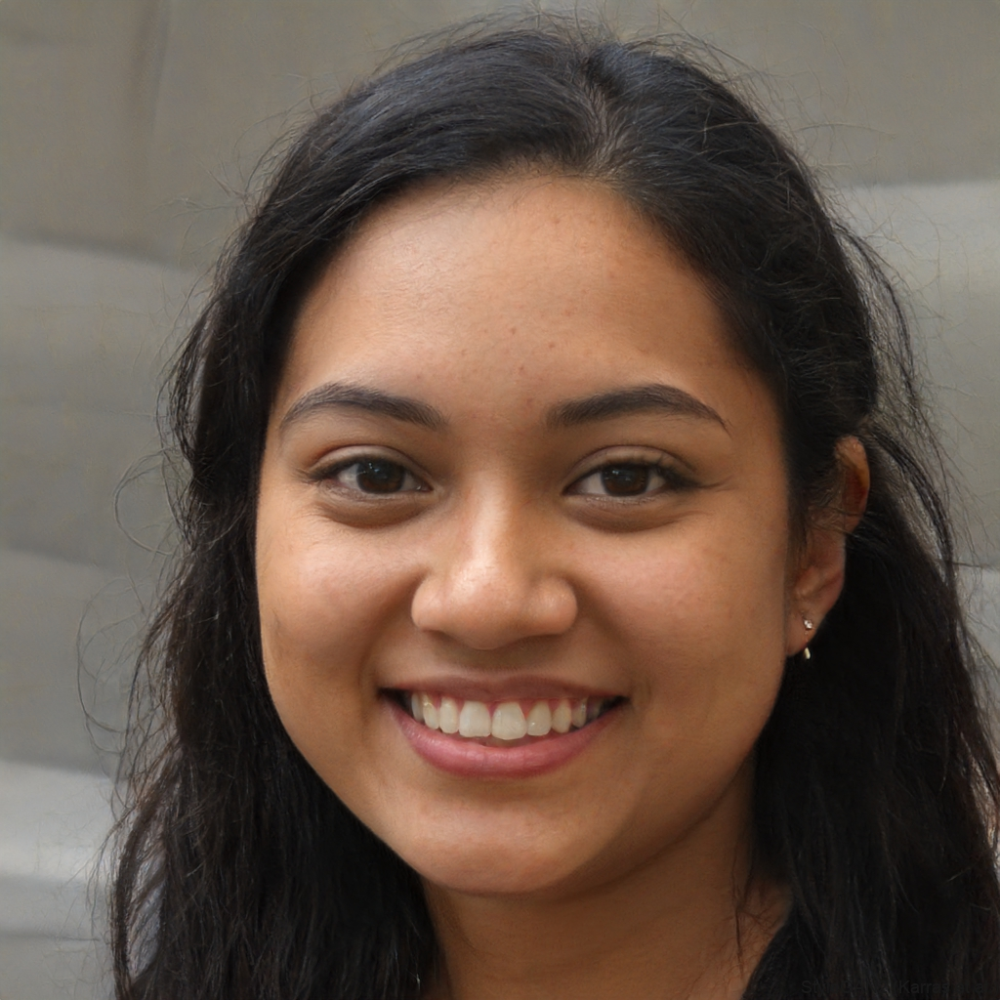
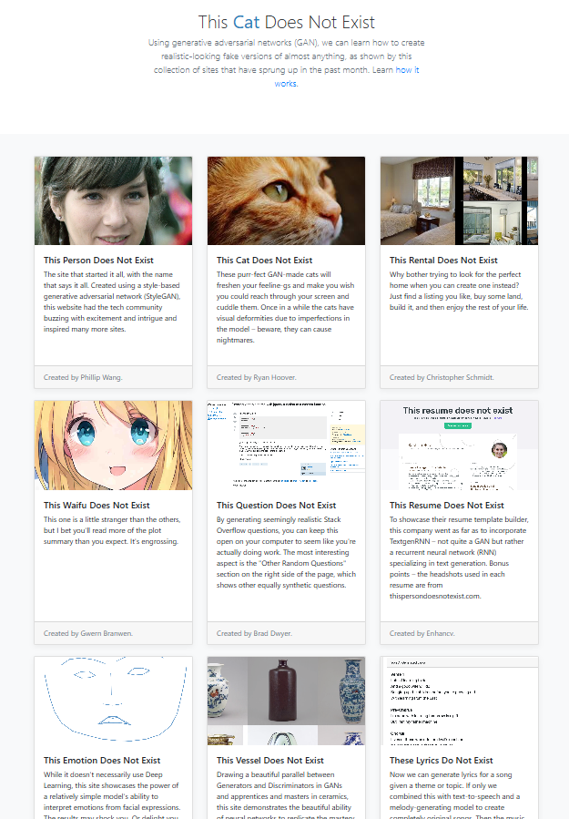

Een verzameling websites met elk één doel: het genereren van een niet-bestaande afbeelding van een persoon, kunstwerk, kat, paard of chemische verbinding. Ze illustreren op een toegankelijke manier hoe GAN-modellen (Generative Adversarial Networks) werken.

{fig-alt="Foto van een door AI gegenereerd, niet-bestaand persoon"}

Hierboven zie je een gezicht gegenereerd door [thispersondoesnotexist.com](https://thispersondoesnotexist.com/). De persoon op deze foto bestaat **niet**. Elke keer dat je de pagina herlaadt (niet de pagina die je nu aan het lezen bent, maar de website waar de foto vandaan komt), zie je een nieuw, volledig gefabriceerd portret.

{.img-fluid .rounded}

::: {.callout-warning}
## Veel sites werken niet meer

Veel van de sites die hier bij vorige edities van de module werden genoemd werken niet meer. Dat is niet erg. Het laat zien hoe snel de ontwikkelingen gaan. Maar ik heb ze daarom niet meer individueel gelinkt hier. 

:::

## Hoe werkt het? — GAN uitgelegd
Deze sites maken gebruik van een **GAN** (Generative Adversarial Network, in het Nederlands: generatief antagonistennetwerk). Een GAN bestaat uit twee neurale netwerken die elkaar beconcurreren:

- De **generator** maakt nep-afbeeldingen
- De **discriminator** probeert echte van neppe afbeeldingen te onderscheiden

Door dit spel van bedriegen en ontmaskeren worden beide netwerken steeds beter — tot de generator afbeeldingen maakt die niet meer van echt te onderscheiden zijn.

Uitleg over hoe het werkt:




