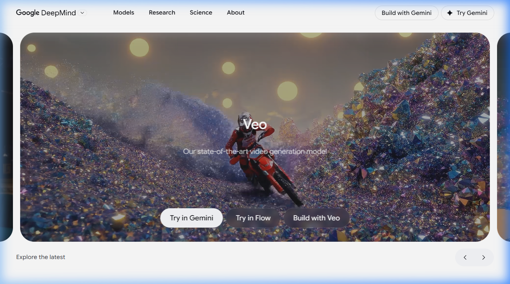

{.img-fluid .rounded}

[Veo 3.1](https://gemini.google/overview/video-generation/) is Google's AI-videogeneratiemodel, beschikbaar via de [Gemini](gemini.qmd)-app. Het model genereert **korte video's met geluid** op basis van een tekstprompt — inclusief omgevingsgeluiden, muziek en stemmen.

De slogan luidt treffend: *"Doorbreek de stilte"* — een verwijzing naar het feit dat eerdere AI-videogeneratoren geen audio produceerden.

## Wat kan Veo 3.1?

- **Tekst naar video**: beschrijf een scène en Veo genereert een video van enkele seconden
- **Met geluid**: niet alleen beelden, maar ook realistische geluiden, muziek en spraak
- **Stijlen**: realistisch, animatie, cinematografisch
- **Toepassingen**: verkennen van creatieve ideeën, memes, concept-visualisaties, prototypering

Enkele toepassingsgebieden die Google noemt:
- *Om te verkennen*: speel met verschillende stijlen en breng geanimeerde personages tot leven
- *Om te delen*: maak grappige memes of persoonlijke video's voor speciale momenten
- *Om te brainstormen*: doorbreek creatieve blokkades en visualiseer ideeën snel

## Veiligheidsmaatregelen

Alle video's gemaakt met Veo bevatten een **zichtbaar watermerk** én een onzichtbaar digitaal watermerk via [SynthID](https://deepmind.google/technologies/synthid/) — een door Google DeepMind ontwikkelde techniek die aangeeft dat de video AI-gegenereerd is.

## Gratis vs. betaald

Veo 3.1 is beschikbaar via een **Google AI Pro- of Ultra-abonnement**:

| Abonnement | Toegang |
|---|---|
| Gratis Gemini | Geen Veo |
| Google AI Pro (~€22/mnd) | Veo 3.1 Fast |
| Google AI Ultra (~€250/mnd) | Veo 3.1 (volledige kwaliteit) |

## Vergelijking met andere videogeneratoren

| Tool | Sterk in | Geluid? |
|---|---|---|
| Veo 3.1 | Realistische video + geluid | ✅ |
| [Runway ML](runway-ml.qmd) | Creatieve stijlen, bewerkingen | ❌/beperkt |
| [Kling AI](kling-ai.qmd) | Lange video's, lipsynced characters | ✅ |
| [Synthesia](synthesia.qmd) | Presentatie-avatars | ✅ |

## Educatieve relevantie

Veo illustreert hoe snel AI-videogeneratie zich ontwikkelt. Een paar jaar geleden vereiste het maken van een korte filmscène een volledig productieteam. Nu kost het een tekstzin. Dat vraagt om een gesprek over **authenticiteit van beeldmateriaal** en de toekomst van filmproductie.
