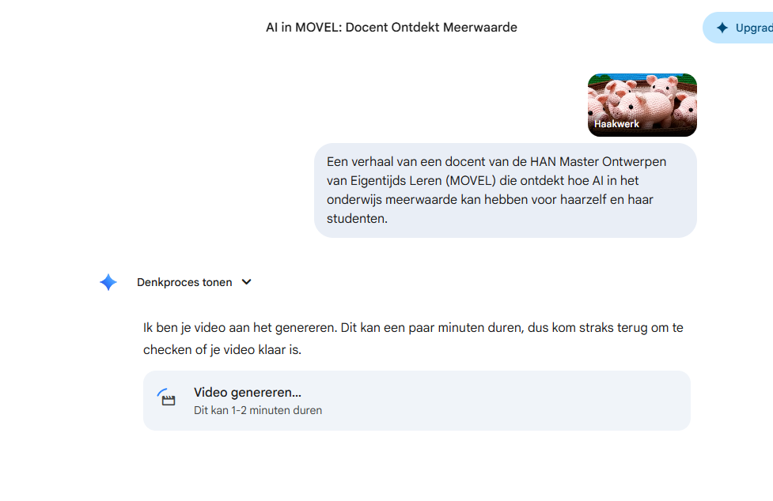

{.img-fluid .rounded}

[Veo 3.1](https://gemini.google/overview/video-generation/) is Google's AI-videogeneratiemodel, beschikbaar via de [Gemini](gemini.qmd)-app. Het model genereert korte video's met geluid op basis van een tekstprompt — inclusief omgevingsgeluiden, muziek en stemmen.
De slogan luidt treffend: *"Doorbreek de stilte"* — een verwijzing naar het feit dat eerdere AI-videogeneratoren geen audio produceerden.

Alle video's gemaakt met Veo bevatten een zichtbaar watermerk en een onzichtbaar digitaal watermerk via [SynthID](https://deepmind.google/technologies/synthid/) — een door Google DeepMind ontwikkelde techniek die aangeeft dat de video AI-gegenereerd is.
Veo 3.1 is beschikbaar via een Google AI Pro- of Ultra-abonnement.

Het resultaat van mijn poging:

Het werkt net zo vaak niet als wel. Met een Pro-account kan ik 3 video's per dag genereren. 