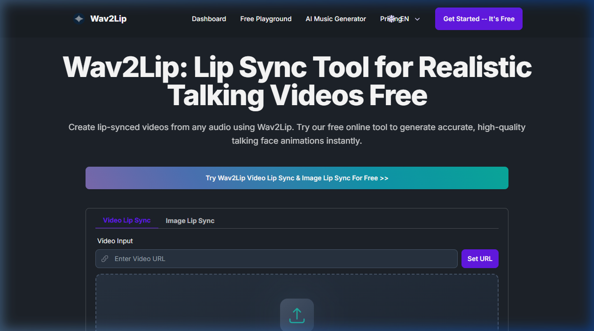

{.img-fluid .rounded}

[Wav2Lip](http://bhaasha.iiit.ac.in/lipsync/) is een vroeg (2020) maar invloedrijk onderzoeksproject van het IIIT Hyderabad dat aantoonde dat je een foto of video van een persoon kunt laten "spreken" op basis van een audio-opname. De lipsynchronisatie is niet perfect, maar was voor zijn tijd ronduit indrukwekkend.

## Hoe werkt het?

Wav2Lip combineert drie zaken:
1. Een afbeelding of video van een gezicht
2. Een audio-opname van de gewenste spraak
3. Een neuraal netwerk dat de lippen in de video aanpast aan het audiobestand

Het resultaat is een deepfake-video waarbij het lijkt alsof de persoon op de foto spreekt.

## Demonstratie

Hieronder een demonstratie van het principe:



Een voorbeeld van het resultaat: een Hamlet-monoloog gezongen door een historische afbeelding, gemaakt via Google Colab:



De volledige video:



## Context 

Wav2Lip was toonaangevend in 2020, maar de technologie is sindsdien dramatisch verbeterd. Diensten zoals [HeyGen](heygen.qmd) en [ElevenLabs](elevenlabs.qmd) bieden tegenwoordig vergelijkbare (en veel betere) resultaten met een gebruiksvriendelijke interface.

Wav2Lip is echter historisch interessant als vroeg voorbeeld van hoe **open onderzoek deepfaketechnologie democratiseerde**. De code staat nog steeds op [GitHub](https://github.com/Rudrabha/Wav2Lip).
